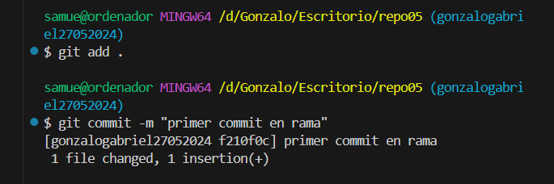
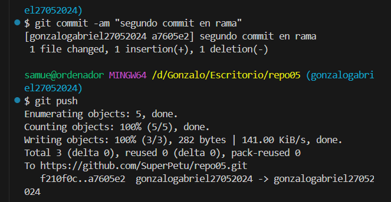
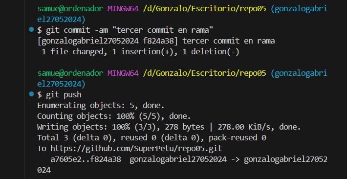
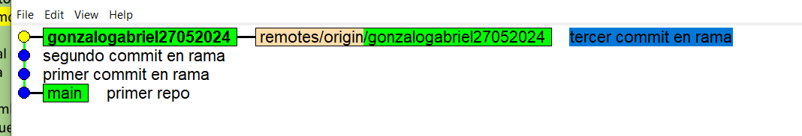
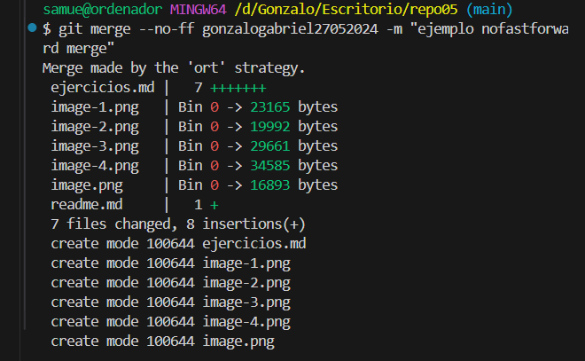
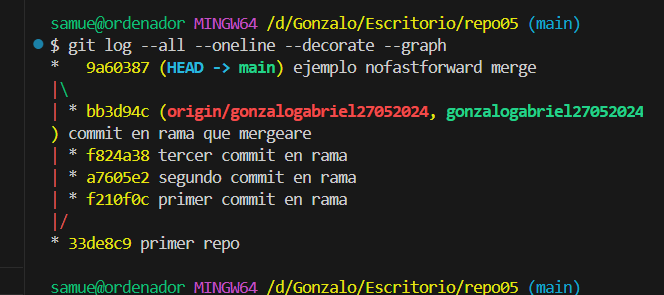
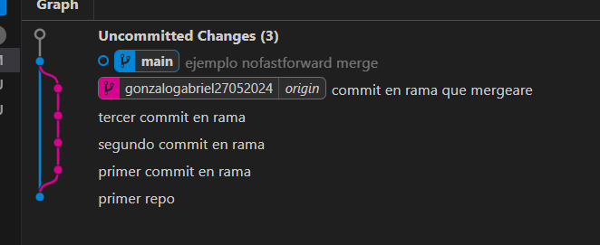

5.3: 

5.4: 

5.5: 

5.6: 

5.7: 

5.8: Un merge fast forward combina lo que tiene la rama con el main, combinando las dos en el main, mientras que el no fast forward no lo hace, y mantiene la referencia de la otra rama